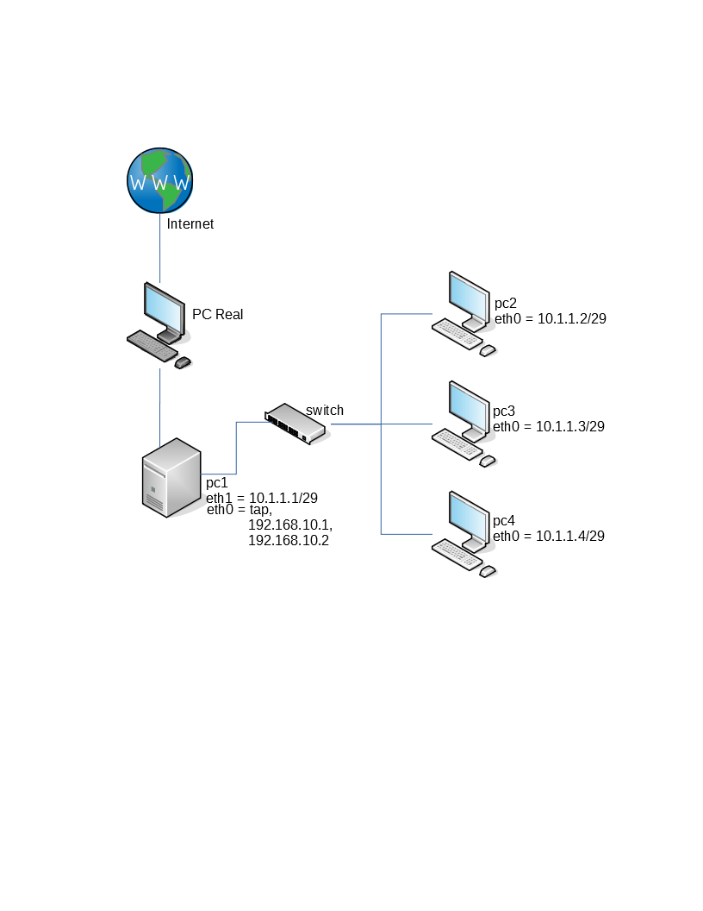

== Configurando servidor Dynamic DNS
Prof. Thiago Guimarães Tavares - thiagogmta@gmail.com
IFTO Campus Palmas

:cap: cap4-ddns

.Objetivos do capítulo
____________________
Ao final deste capítulo você deverá ser capaz de:

* Compreender os detalhes de funcionamento do servidor DDNS e sua relação com o DHCP e DNS
* Realizar a configuração do servidor DDNS em ambiente Linux
* Realizar testes para atualização automática das tabelas de nomes do servidor DNS
____________________

=== Apresentação: DDNS

==== O que é?
DDNS é abreviação para Dynamic DNS, ou Sistema de Nomes de Domínios Dinâmico. É um método utilizado para atualizar automaticamente um servidor de nomes de domínio.

==== Para que serve?
O DDNS é um complemento ao DNS e tem como objetivo relacionar um nome de domínio a um determinado usuário/host e manter esse relacionamento mesmo que o endereço IP desse usuário/host seja alterado. Podemos apresentar o exemplo de uma conexão de internet comum em uma residência. O modem do usuário irá receber um endereço de IP fixo do provedor para que possa acessar a internet. Entretanto, eventualmente o endereço do modem do usuário pode mudar, em decorrência de um eventual desligamento do aparelho ou de configurações preestabelecidas pelo provedor. Essa forma de funcionamento impede o usuário de realizar um relacionamento de nome com seu IP pois este irá ser alterado de tempos em tempos. Através do DDNS é possível por exemplo relacionar o domínio thiagogmta.net a um determinado host, mesmo que o endereço IP desse host mude. Podemos citar o No-IP um dos mais famosos provedores de serviços DDNS que disponibiliza seu serviço de forma gratuita até três hosts.
 
==== Como funciona?
Ao receber uma solicitação de atribuição de endereço IP o servidor DHCP, após atender a requisição, envia uma notificação ao servidor DNS sobre o novo host e seu endereço. O servidor DNS, por sua vez, de posse daquelas informações, atualiza sua base de dados de endereços.

=== DDNS: Exemplificação

==== Criação do Ambiente

NOTE: Leve em consideração que nosso ambiente tem a seguinte topologia implementada através do netkit:

.Topologia de testes

WARNING: Para implementação do DDNS será necessário a configuração de um servidor DHCP e o relacionamento deste servidor com o servidor DNS. Dessa forma, iremos levar em consideração que o PC1 será o servidor DHCP e DNS.

==== Configuração do servidor DHCP

O servidor DHCP deve possuir um IP fixo. Dessa forma este host será configurado com o endereço IP *10.1.1.1*.

[source, bash]
----
$ ifconfig eth1 10.1.1.1/29
----

===== Configurações Iniciais

As configurações referentes ao dhcp serão feitas no arquivo /etc/dhcpd3/dhcpd.conf 

TIP: É possível inserir as configurações desejadas diretamente no arquivo original ou fazer um backup do arquivo e criar um novo apenas com as configurações desejadas. Fica ao seu critério. Para o desenvolvimento deste material foi criado um novo arquivo.

[source,bash]
----
$ mv /etc/dhcp3/dhcpd.conf /etc/dhcp3/dhcpd.conf.old
$ touch /etc/dhcp3/dhcpd.conf
$ nano /etc/dhcp3/dhcpd.conf
----
No novo arquivo de configuração foram inseridas as seguintes linhas:

[source,bash]
----
ddns-update-style none; <1>
default-lease-time 600; <2>
max-lease-time 7200; <3>
authoritative; <4> 

subnet 10.1.1.0 netmask 255.255.255.248{ <5>
	range 10.1.1.2 10.1.1.6; <6>
	option subnet-mask 255.255.255.248; <7>
	option routers 10.1.1.1; <8>	
	option broadcast-address 10.1.1.7; <9>
	option domain-name-servers 10.1.1.1; <10>
	option domain-name "thiago.net"; <11>
	
}
----

<1> Desabilita atualização dinâmica
<2> Informa que o servidor dhcp irá verificar a cada 600 segundos se as estaçãoes estão ativas.
<3> Determina o tempo máximo que um host pode ficar com um endereço.
<4> Define como servidor DHCP principal da rede
<5> Informa o endereço da rede e sua máscara. Dentro do seu bloco são inseridas as configurações para distribuição de endereços.
<6> Faixa de distribuição de endereços
<7> Máscara da rede
<8> Endereço de Gateway padrão
<9> Endereço de broadcast da rede
<10> Servidor DNS (caso exista)
<11> Nome do domínio

*> Interfaces* 

Como nosso servidor possui duas interfaces de rede precisamos informar ao servidor qual das duas interfaces irá responder às solicitações de endereçamento IP. Para isso devemos editar o arquivo _/etc/default/dhcp3-server_. Dentro dessa linha alterar o parâmetro INTERFACES e informar a interface desejada fincando dessa maneira:

[source, bash]
----
#/etc/default/dhcp3-server
INTERFACES="eth1"
----

Salve e feche o arquivo.

Ao finalizar inicie (ou reinicie) o servidor para validar as configurações.

[source,bash]
----
$ /etc/init.d/dhcp3-server start
----

////
===== Definindo um IP fixo para o servidor DNS no DHCP
Como necessitamos que o servidor DNS tenha um IP fixo para que os clientes possam lhe enviar solicitações, faremos essa configuração inserindo o seguinte bloco de informações ao final do arquivo dhcpd.conf

[source,bash]
----
host pc2 { <1>
	hardware ethernet fe80::2c18:ccff:fed4:8ce7; <2>
	fixed-address 10.1.1.2; <3>
}
----
<1> Bloco de configuração para endereçamento fixo para o host pc2
<2> Endereço físico do host
<3> Endereço Ip que será atrelado ao host do endereço físico informado

IMPORTANT: Não se esqueça de configurar a interface que irá receber as requisições do servidor DHCP em /etc/default

////

===== Testando

Feitas as configurações, acessaremos apenas o host *pc2* inicialmente  e solicitaremos atualização de endereço.

[source,bash]
----
$ dhclient eth0
----

Posteriormente faremos testes nos pcs 3 e 4.

Caso seja necessário a remoção de endereço em algum dos hosts para realizar novos testes utilize o comando:

[source,bash]
----
$ ip address flush dev eth0
----

Configurações iniciais do servidor DHCP finalizadas.

==== Configuração do servidor DNS

Feita a configuração do servidor DHCP partiremos para a configuração do servidor DNS.

IMPORTANT: Utilizaremos como base o domínio thiago.net. Não se esqueça de configurar essa informação no arquivo /etc/hosts.

===== Criação das Zonas

O primeiro passo para configuração do DNS é acessar o arquivo named.conf.local e criar as zonas de configuração.

[source,bash]
----
$ nano /etc/bind/named.conf.local
----

[source,bash]
----
//Zona de pesquisa direta
zone "thiago.net"{ <1>
	type master; <2>
	file "/etc/bind/db.thiago.net"; <3>
};

//Zona de pesquisa reversa
zone "1.1.10.in-addr.arpa"{ <4>
	type master;
	file "/etc/bind/db.10"; <5>
};
----
<1> Nome da zona onde thiago.net é o domínio
<2> Tipo de zona
<3> Caminho do arquivo da zona direta (deverá ser criado)
<4> Zona reversa que é representada pelo Ip do servidor ao contrário sem o ultimo octeto seguido da terminação .in-addr.arpa (padrão)
<5> Caminho do arquivo de zona reversa

===== Configurando os Encaminhadores

A medida que nosso servidor DNS receber requisições de resolução de nomes quais ele não saiba a resposta deverá encaminha-las a um próximo servidor DNS. Descomentar o bloco representado lobo a baixo e inserir um endereço Ip de outro servidor DNS.

[source,bash]
----
$ nano /etc/bind/named.conf.options
----

[source,bash]
----
fowarders{
	8.8.8.8
}
----

===== Criação de arquivos para as Zonas: Direta e reversa

Para facilitar o trabalho faremos uma cópia de dois arquivos já existentes que servirão de base:

[source,bash]
----
$ cp /etc/bind/db.local /etc/bind/db.thiago.net
$ cp /etc/bind/db.127 /etc/bind/db.10
----
*Zona Direta*

[source,bash]
----
$ nano /etc/bind/db.thiago.net
----

[source,bash]
----
; BIND - Zona Direta (nome.com.br)
;---
$TTL    604800
@       IN      SOA     pc1.thiago.net. root.thiago.net. (
                		2014051801       ; Serial
                            604800       ; Refresh
                             86400       ; Retry
                           2419200       ; Expire
                            604800 )     ; Negative Cache TTL
;
@       IN     NS       pc1.thiago.net.
pc1     IN     A        10.1.1.1

@       IN      NS      localhost.
@       IN      A       127.0.0.1
@       IN      AAAA    ::1
----

*Zona Reversa*

[source,bash]
----
$ nano /etc/bind/db.10
----

[source,bash]
----
; BIND - Zona Reversa (nome.com.br)
;---
$TTL    604800
@       IN      SOA     pc1.thiago.net. root.thiago.net. (
                        2014051801       ; Serial
                            604800       ; Refresh
                             86400       ; Retry
                           2419200       ; Expire
                            604800 )     ; Negative Cache TTL
;
@       IN      NS      pc1.thiago.net.
1       IN      PTR     pc1.thiago.net.

@       IN      NS      localhost.
1.0.0   IN      PTR     localhost.
----

*Validando configurações*

Após as configurações podemos checar as configurações de zonas e verificar eventuais erros através dos comandos:

Para checar as configurações do servidor execute o comando:
[source,bash]
----
$ named-checkconf
----

Para verificar as configurações das zonas utilize os comandos:

[source,bash]
----
$ named-checkzone thiago.net /etc/bind/db.thiago.net
$ named-checkzone thiago.net /etc/bind/db.10
----

Caso retorne OK a configuração está correta. Inicie o servidor.

[source,bash]
----
$ /etc/init.d/bind start
----

===== Testando o servidor DNS

Para verificar se as zonas foram preenchidas corretamente podemos verificar sua tabela através do comando:

[source,bash]
----
$ host -l thiago.net
----

Para testar se os hosts cadastrados estão respondendo por seus respectivos nomes podemos utilizar os comandos ping ou host a partir do pc2 para o pc1.

[source,bash]
----
$ host pc1.thiago.net
$ ping pc1.thiago.net
----

O comando host irá retornar o endereço Ip do pc1 e o comando ping irá enviar um pacote para o ip correspondente ao pc1.

=== Configurando o Dynamic Domain Name System

O ponto interessante do DDNS é que a medida que o servidor DHCP recebe requisições dos clientes ele envia essas informações ao servidor DNS que por sua vez atualiza suas tabelas de resolução de nomes.
As configurações apresentadas até este ponto são configurações básicas para o funcionamento de ambos os serviços DHCP e DNS. Faremos então algumas alterações para habilitar o DDNS.

==== Preparando o servidor DHCP para atualizações Dinâmicas

*Criando chave de autenticação*

dnssec-keygen -a HMAC-MD5 -b 128 -n HOST ddns

Ao executar o comando teremos um retorno semelhante a esse:

[source,bash]
----
K<nome da chave>.+157+60250
----

Também será criado um arquivo de mesmo nome. No caso desse exemplo foi criado o arquivo: _Kddns.+157+60250.key_

acesse o arquivo criado copie a chave gerada. No caso desse exemplo a chave gerada foi: _N5+rdUh6jLGHPinu4bmalg==_

acesse o arquivo dhcpd.conf e certifique-se das seguintes configurações:

*Realizando configurações*

[source,bash]
----
ddns-update-style interim;
option domain-name "thiago.net";
authoritative;
log-facility local7;
----

Crie uma sessão para a chave

[source,bash]
----
key ddns {
   algorithm hmac-md5;
   secret "<sua chave aqui>";
}; 
----

Defina suas zonas

[source,bash]
----
zone thiago.net. {
   primary 10.1.1.1;
   key ddns;
}

zone 1.1.10.in-addr.arpa. {
   primary 10.1.1.1;
   key ddns;
} 
----

Reinicie o servidor dhcp

==== Preparando o servidor DNS para atualizações Dinâmicas

Acesse o arquivo de configuração named.conf e insira a chave criada no passo anterior:

[source,bash]
----
key ddns {
   algorithm hmac-md5;
   secret "<sua chave aqui>";
};
----

Crie a sessão controls no mesmo arquivo named.conf

[source,bash]
----
controls {
   inet 127.0.0.1 port 953
   allow { 127.0.0.1; }
   keys { "ddns"; };
};
----

Acesse o arquivo named.conf.local e adicione as seguintes configurações em seus arquivos de zonas:

[source,bash]
----
zone "thiago.net" {
   type master;
   file "/etc/bind/db.thiago.net";

   notify no;
   allow-update { key ddns; };
};

zone "1.1.10.in-addr.arpa"{
   type master;
   file "/etc/bind/db.10";

   notify no;
   allow-update { key ddns; };
};
----

Altere o conteúdo do arquivo rndc.key (/etc/bind/rndc.key) e insira a sua chave dentro do arquivo.

Vamos checar as configurações do servidor:

[source,bash]
----
$ named-checkconf
----

Caso tudo esteja ok, reinicie o servidor.

*O pulo do Gato*

Para máquinas linux é preciso alterar o arquivo _/etc/dhcp3/dhclient.conf_ nos computadores clientes e alterar a seguinte linha:

[source,bash]
----
send host-name "hostname";
----

Onde "hostname" deve ser substituido pelo nome da máquina

*Testando*

Chegou a hora da verdade!

1. Execute, no servidor, o comando tail -f /var/log/syslog para monitorar as entradas do servidor. Através desse comando poderemos visualizar as solicitações de endereçamento IP dos nossos clientes.

2. Lembra que até o momento só setamos endereço IP no pc 02 através do dhcp? Bom agora vamos fazer o teste nos pcs 03 e 04 execute o comando dhclient eth0.